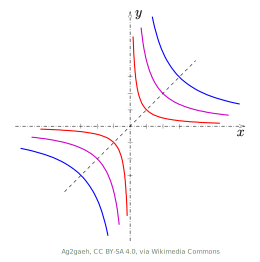

There is an intriguing geometry-sounding question that appears in a mathematics textbook used by [Malaysian Chinese independent secondary schools](https://en.wikipedia.org/wiki/Chinese_independent_high_school), which is stated as follows:-

> _A curve has the following property: for any tangent line to the curve, its line segment that lies between the two coordinate axes is bisected by the tangent point. Find the equation of the curve._[^1] <cite>Advanced Mathematics, Upper Secondary 3 (Volume 2), 1st edition, UCSCAM</cite>

For now, I will not reveal the chapter of the textbook in which this question is featured in order not to spoil the fun. Assuming that we encounter this question out of nowhere (say, a final exam paper), this problem may seem vague and thus not easy to navigate a strategy of solving it at first glance.

However, we can still see a first step. Since this question involves curves, at least we can draw a figure.

## Sketch the Big Picture

Here, we assume that the curve passes through the point $P(x_0,y_0)$, and it lies on the [first quadrant](https://en.wikipedia.org/wiki/Quadrant_(plane_geometry)) of the 2D Cartesian plane and does not touch the axes. We then plot $P$ on the plane.

We could try to guess the shape of the curve that passes through $P$, and determine its tangent line on $P$ from there. However, it is actually more straightforward to set the curve issue aside first, and instead focus on the tangent line itself, considering that more information about the tangent line is given in the question.

## Determine the Tangent Line Segment

We refer back to this part of the question:

> ..._for **any** tangent line to the curve, its line segment that **lies between the two coordinate axes** is **bisected** by the tangent point._ 

There are several implications made by this statement alone:-
- Any tangent line of the curve produces a line segment that is _enclosed by_ the $x$- and $y$-axes, i.e. there won't be horizontal or vertical tangent lines.
- For any such line segment, it can be bisected by its own _tangent point_, i.e. the intersection point between the line and the curve itself.
- The curve will not touch the axes. This is because even if the curve does touch any axis at a point, and the tangent line to the curve at the point does produce a line segment enclosed by both of the axes, the tangent point will become an endpoint of the segment instead, contradicting the given condition that it bisects the segment.

These implications indeed apply for the tangent to the curve at the point $P$, which we assume to lie on the first quadrant without touching the axes (which we now know is guaranteed), as well.

In this case, the tangent line will not be a horizontal nor vertical line (otherwise it cannot be enclosed by both axes). It will also not be a line with a positive gradient as the resulting enclosed line segment will lie on the second quadrant, thus not passing through the tangent point itself.

Therefore, the tangent line can only be one with a negative gradient, with the required line segment within the first quadrant.

## Find the x-intercept

Next, we try to find the $x$-intercept of the tangent line, which will come handy later (if you peek at the title of the next section).

Notice that the axes and the tangent line segment enclosed by them form a right-angled triangle. The $x$-intercept of the tangent line is then the vertex opposite the right angle, which we will denote here by $Q(k,0)$, where $k>x_0$ as it is at the right side of $P$. To find where $Q$ is, we need to find the value of $k$.

Now, if we draw a vertical line from the point $P$ to the base of the triangle, can you see what we then obtain?

Yes, we get two [similar triangles](https://www.khanacademy.org/test-prep/praxis-math/praxis-math-lessons/gtp--praxis-math--lessons--geometry/a/gtp--praxis-math--article--congruence-and-similarity--lesson) (try verifying this if this is unclear to you by considering the angles of the triangles). Even better, thanks to the property that the point $P$ _bisects_ the line segment, we get two similar triangles such that the length of the hypotenuse of the smaller triangle is exactly half of the larger one!

This allows us to utilise the equality of the corresponding side length ratios of similar triangles to find the value of $k$. 

It is more straightforward to calculate the lengths of the base of the two triangles, simply by subtracting the larger $x$-coordinate by the smaller one, but not so for the hypotenuses. We could use the [Euclidean distance formula](https://en.wikipedia.org/wiki/Euclidean_distance#Two_dimensions) but we don't have enough information to apply that.

Still, not all hope is lost. We know that the lengths of the hypotenuses are proportionally related, i.e. if we denote the length of the hypotenuse of the smaller triangle by $l$, then the hypotenuse length for the larger one is $2l$.

Hence, by the equality in the corresponding side length ratios, we get: $$\frac{\text{base length of smaller} \bigtriangleup}{\text{hyp. length of smaller} \bigtriangleup}=\frac{\text{base length of larger} \bigtriangleup}{\text{hyp. length of larger} \bigtriangleup}$$ $$\Rightarrow \frac{k-x_0}{l}=\frac{k}{2l}$$ $$\Rightarrow k=2x_0$$

Therefore, $Q=(2x_0,0)$. Note as well that the exact value of $l$ does not matter because it's been cancelled out during the calculation above.

## Introducing, Differential Equations

Now that we obtain two points on the tangent line (segment), let's shift our focus to two keywords in the question, 'curve' and 'tangent'. If you've taken a calculus course before, they may remind you of the first derivative, or more precisely, the fact that the gradient of the tangent line to a curve on a Cartesian plane at a point corresponds to the first derivative of the curve at the point.[^2]

This is where the two points on the tangent line we've previously obtained, $P$ and $Q$ become useful. We can apply [the gradient formula](https://en.wikipedia.org/wiki/Slope) to obtain another expression of the gradient of the tangent line to the curve at $P$, denoted here as $m_{PQ}$. $$m_{PQ}=\frac{y_Q-y_P}{x_Q-x_P}=\frac{0-y_0}{2x_0-x_0}=-\frac{y_0}{x_0}$$

Recognising that both the first derivative, $\frac{dy}{dx}$, and the calculated expression above represent the gradient of the tangent line, we can equate them to form the following equation: $$\frac{dy}{dx}=-\frac{y_0}{x_0}$$

Since our choice of the point $P$ is (to some extent in this case, but in general actually still) arbitrary, we can just replace $(x_0,y_0)$ with the variable form $(x,y)$ and obtain the following: $$\frac{dy}{dx}=-\frac{y}{x}$$

This is a differential equation, or more precisely, a [first-order separable ordinary differential equation](https://tutorial.math.lamar.edu/Classes/DE/Separable.aspx)! To solve this equation, we can 'rearrange' the terms, ... $$\frac{1}{x}dx=-\frac{1}{y}dy$$

...then integrate both sides of the equation, ... $$\int{\frac{1}{x}}dx=\int{\left(-\frac{1}{y}\right)}dy \Rightarrow \ln x = -\ln y + C' \Rightarrow \ln x + \ln y = C'$$

...and using [the properties of natural logarithm](https://en.wikipedia.org/wiki/Natural_logarithm#Properties), we finally obtain the following: $$xy=C$$ (where $C$ and $C'$ above are constants of integration, and $C=e^{C'}$).

This is the general equation of the curve that we're looking for.

## About the Answer

You may ask: what is so special about the equation we've found?

If you've learnt some analytic geometry before, you may recognise that it is the general equation of a rectangular hyperbola with the coordinate axes as asymptotes!

If we are given an initial condition, i.e. a point on the curve, say, $(3,2)$, then we can solve for a specific value of $C$ by substituting the $x$- and $y$-coordinates into the general solution and obtain a particular solution, which in this case is $xy=6$.

Notice that if such point lies on the first or third quadrant, the $xy$-coordinates will be either both positive or both negative, which results in a positive value of $C$. On the other hand, if it lies on the second or fourth quadrant, the $xy$-coordinates will be of different signs, thus resulting in a negative value of $C$.

This explains why the choice of the intersection point $P$ as mentioned above is _really_ arbitrary, as no matter which quadrant $P$ lies on, the resulting curve will still be a rectangular hyperbola with the axes as asymptotes.

## Conclusion

Having solved this question, I can now reveal that this question appears in the chapter about ordinary differential equations, thus students discovering this question from the textbook at least are implied a concrete direction of solving it.

It is interesting to see how differential equations can be applied to solve a question that is seemingly unrelated to it, and how its answer provides us a useful insight to better understand a fairly standard shape in analytic geometry. 

I also like how it introduces some sort of curve ball by leading us to apply our knowledge about similar triangles to answer a question that is supposed to serve a purpose of training students on solving differential equations. This further demonstrates how different branches of mathematics interconnect in mathematical problem solving.

As an extra exercise, you may try solving this similar question, also found in the same textbook:
> Find the equation of a curve such that the $y$-intercept of its tangent lines is equal to the $x$-coordinate of the tangent point.
> _(Hint: this question involves [homogenous first-order differential equations](https://en.wikipedia.org/wiki/Homogeneous_differential_equation#Homogeneous_first-order_differential_equations).)_

[^1]: Actually, this question is originally written in Chinese, and an initial condition that the curve passes through the point (2, 3) is given in the original. For the curious, here's the original question: “一曲线通过点（2，3），它在两坐标轴间的任意切线线段均被切点所平分，求这曲线方程。” However, in this article, I'd like to focus on the general solution, so I've slightly edited the question.

[^2]: In multivariable calculus, the intuition of associating derivatives with gradients becomes less helpful. You may watch [this video by Mathemaniac](https://www.youtube.com/watch?v=wCZ1VEmVjVo) for a more in-depth way of understanding derivatives.